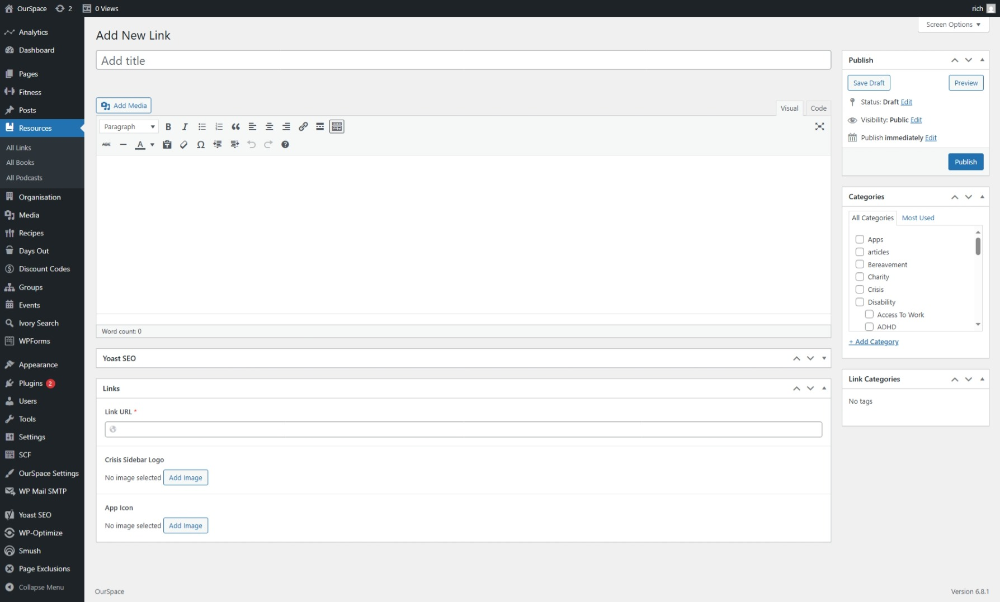
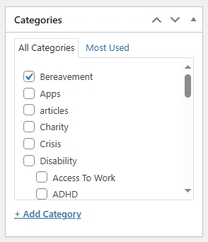

The platform has it's own links directory, this lives under the self-help resources, to add a new entry to the directory follow these steps.

* First navigate to the Admin Dashboard of OurSpace if you are not already there.
* From the navigation menu on the left hand side of the page, hover over resources and from the menu that appears click _Links_
* Click the button _Add new link_ a new screen should appear that looks something like the image below

* Add a title for your link in the title box.
* In the large box add a description about the link.
* On the right hand side of the screen, select the category that this link should exist under, categories match topic pages as we saw in the [_creating new topic_](docs/topics/creating-topic.md) section this is because links can be shown on topic pages, if you don't select a category, your link will not be visible on the platform.

* Complete all of the required fields in the Link Settings

|Field Name           | Mandatory | Description
|---------------------|-----------|------------------------------ |
| Link URL            |  Yes      | The URL of the link   |
| Crisis Sidebar Logo |  No      | The logo of the link if it is to appear in the crisis sidebar   |
| App Icon            |  No      | The application icon if it is to appear in the application sidebar     |

Once you are happy that all of the information has been completed, scroll back up to the top of the page and click the _Publish_ button which can be found under the _Publish_ section in the right side of the screen.

Your link should now be visible on the topic page that you select from the categories.