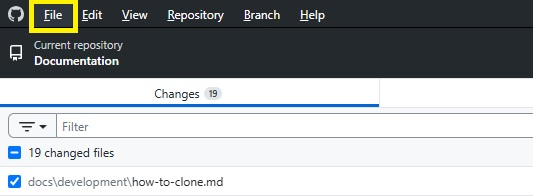
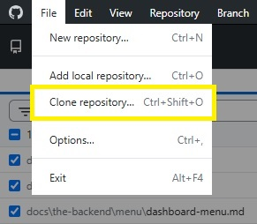
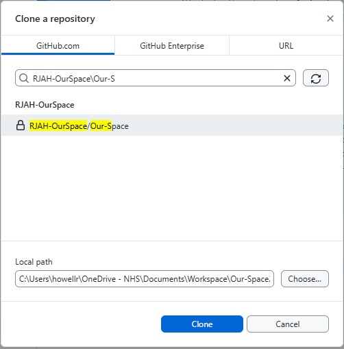
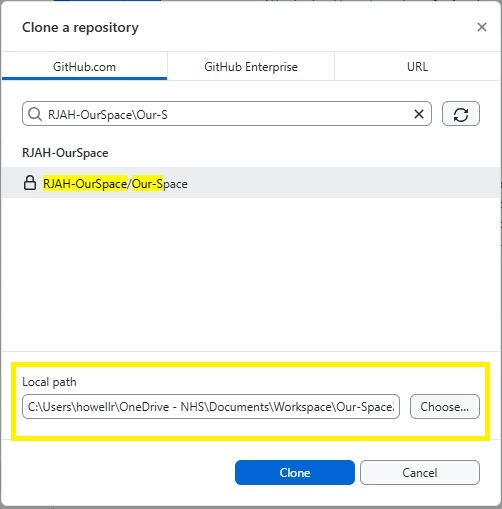
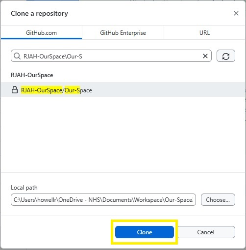

:::note
These instructions are dependant on you having access to the GitHub repository
:::

To ensure that you are developing on the latest version of the platform make sure you pull the code from `Git`

This can be done a number of ways 

1. **Using GitHub Desktop**

:::warning
These instructions assume that you have [GitHub Desktop](https://desktop.github.com/download/) installed, if you don't you will need it before proceeding
:::

* Open GitHub desktop
* Click File



* Click Clone Repository



* Search for OurSpace which can be found in _RJAH-OurSpace\Our-Space_



* Select the location you would like to clone into 



* Press _Clone_



2. **Using Git CLI**

:::warning
These instruction assume that you have [Git](https://git-scm.com/downloads) installed on your local machine, if you don't you will need to install it before proceeding.
:::

* Create a directory to clone into, if you already have one skip this step

```bash
mkdir D:\YourLocation\OurSpace
```

* Make sure the command prompt context is in the folder you created or have available for use

```bash
cd D:\YourLocation\OurSpace
```

* Clone the code from Git

```bash
git clone https://github.com/RJAH-OurSpace/Our-Space.git
```