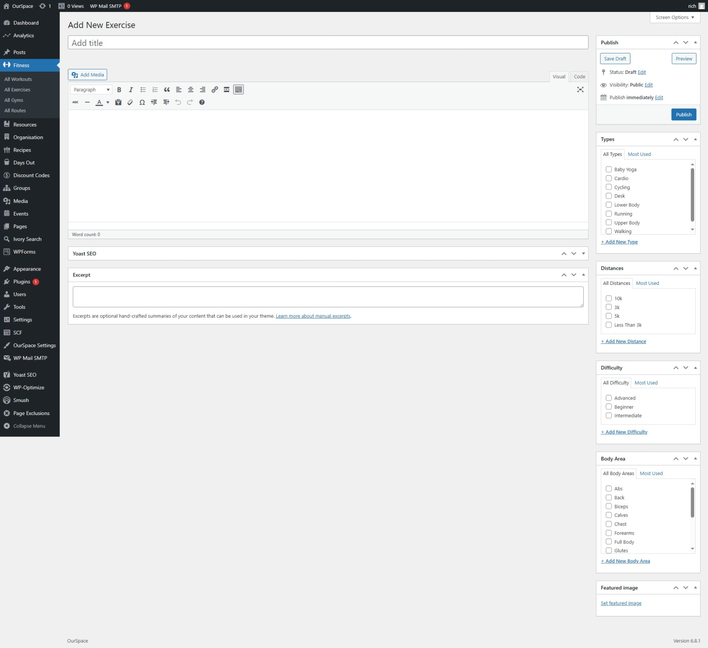
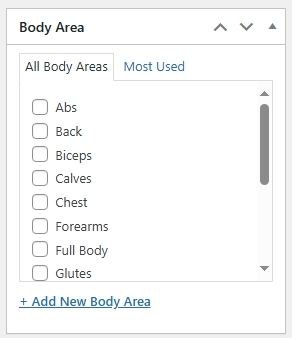
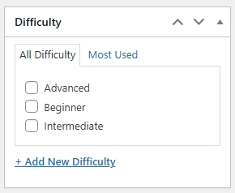
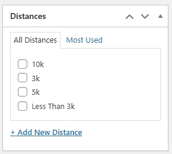
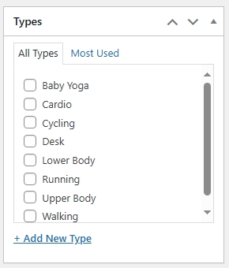

* First navigate to the Admin Dashboard of OurSpace if you are not already there.
* From the navigation menu on the left hand side of the page hover over _Fitness_ and select _All Exercises_ from the menu that appears
* Click the button _Add new exercise_ a new screen should appear that looks something like the image below

* Add a title for your exercise
* In the content box add the details about the exercise.

Down the right hand side of the screen are various options relating to exercises specifically, you can set these per exercise. 

Once you are happy that all of the information has been completed, scroll back up to the top of the page and click the _Publish_ button which can be found under the _Publish_ section in the right side of the screen.

Your exercise should now be visible on the exercise page.