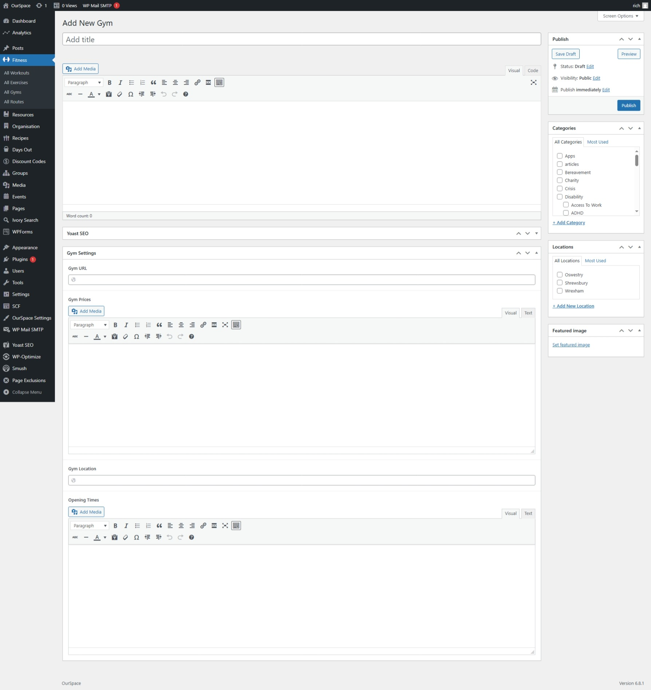
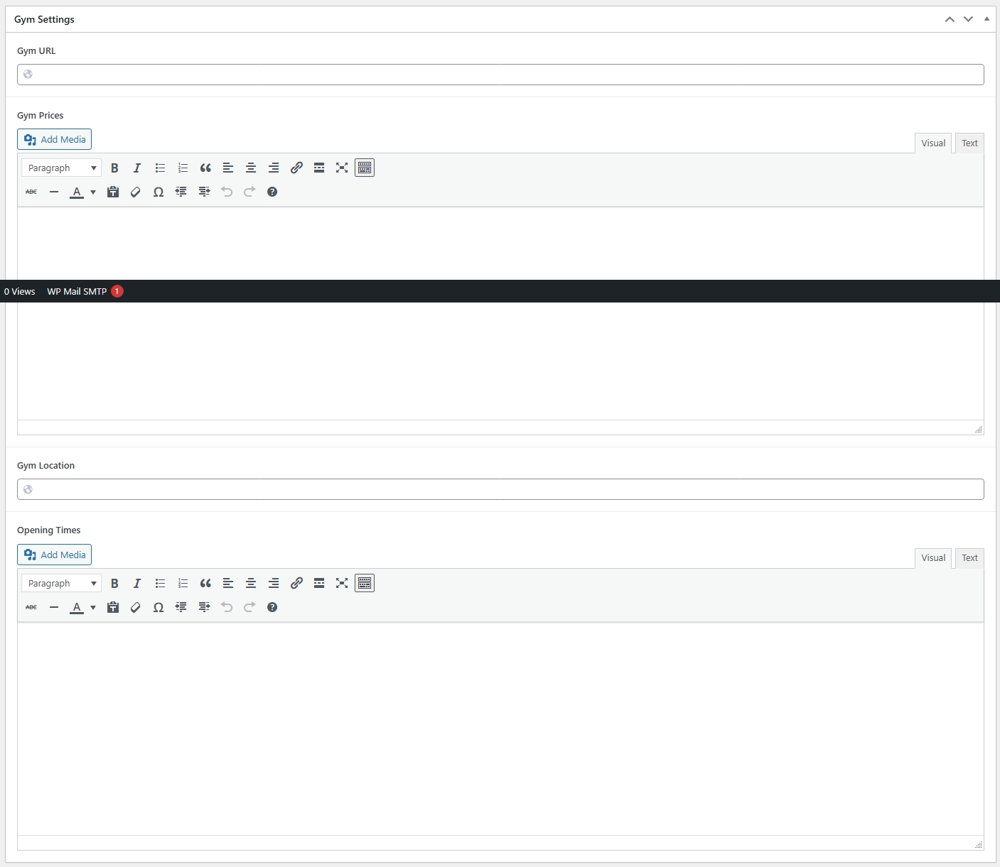
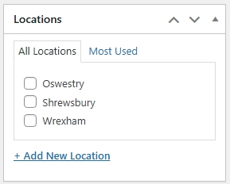
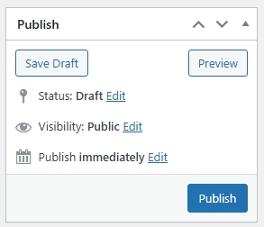

* First navigate to the Admin Dashboard of OurSpace if you are not already there.
* From the navigation menu on the left hand side of the page hover over _Fitness_ and select _All Gyms_ from the menu that appears
* Click the button _Add new gym_ a new screen should appear that looks something like the image below

Add the name of the gym into the title

In the content box you can add a bit about the gym, sometimes the gym has information on it's website which is useful for this area

Once you can completed the above, scroll down to the Gym Settings and complete the fields as required

|Field Name       | Mandatory | Description
|-----------------|-----------|------------------------------ |
| Gym URL         |  No       | The website of the gym   |
| Gym Prices      |  No       | The prices of the gym  |
| Gym Location    |  No       | The location of the gym    |
| Opening Times   |  No       | The opening times of the gym     |

Once you have completed the gym settings, on the right hand side of the screen you will see a box titled _Location_ select the location where this gym resides.

Once you are happy that all of the information has been completed, scroll back up to the top of the page and click the _Publish_ button which can be found under the _Publish_ section in the right side of the screen.

Your gym should now be visible in the gyms directory.