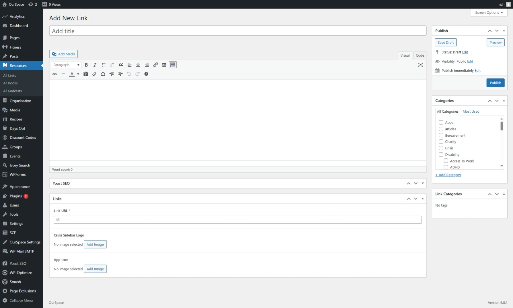
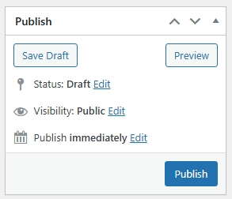

The platform has it's own links directory, this lives under the self-help resources, to add a new entry to the directory follow these steps.

* First navigate to the Admin Dashboard of OurSpace if you are not already there.
* From the navigation menu on the left hand side of the page, hover over resources and from the menu that appears click _Links_
* Click the button _Add new link_ a new screen should appear that looks something like the image below

* Add a title for your link in the title box.
* In the large box add a description about the link.

* Complete all of the required fields in the Link Settings

|Field Name           | Mandatory | Description														   | Condition													 | 
|---------------------|-----------|--------------------------------------------------------------------| ------------------------------------------------------------|
| Link Type           |  Yes      | The type of link that this is   							       |															 |
| Link URL            |  Yes      | The URL of the link                                                |															 |
| Linked Topic        |  No       | The topic that this link relates                                   | Will only be shown if the Link Type equals "Standard Link"  |
| Crisis Sidebar Logo |  No       | The logo of the link if it is to appear in the crisis sidebar      | Will only be shown if Link Type equals "Crisis Link"        |
| App Icon            |  No       | The application icon if it is to appear in the application sidebar | Will only be shown if Link Type equals "Application Link"   |

Once you are happy that all of the information has been completed, scroll back up to the top of the page and click the _Publish_ button which can be found under the _Publish_ section in the right side of the screen.

Your link should now be visible on the topic page that you select from the categories.