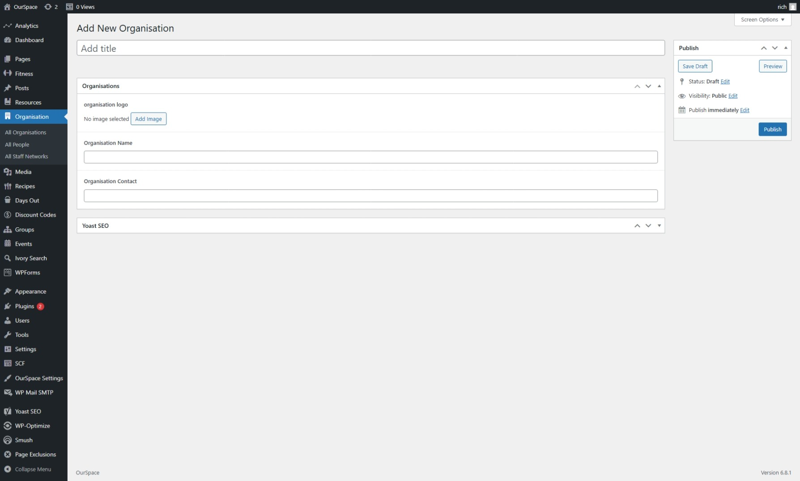

Within the OurSpace platform some content is filterable by organisation in order for these filters to work the organisations need to be added to the platform, this document explains how to do that. 

* First navigate to the Admin Dashboard of OurSpace if you are not already there.
* From the navigation menu on the left hand side of the page, find the _Organisation_ menu, hover over it and click the _All Organisations_ menu from the list that appears
* Click the button _Add new organisation_ a new screen should appear that looks something like the image below

In the title at the top of the screen add the name of the Organisation that you are adding.

The next step is to add the organisation details

|Field Name             | Mandatory | Description
|---------------------- |-----------|----------------------------------------- |
| Organisation logo     |  Yes      | The logo of the organisation             |
| Organisation Name     |  Yes      | The name of the organisation             |
| Organisation Contact  |  Yes      | The primary contact for the organisation |

Once you are happy that all of the information has been completed, scroll back up to the top of the page and click the _Publish_ button which can be found under the _Publish_ section in the right side of the screen.

Your organisation should now be available for use in other parts of the platform.