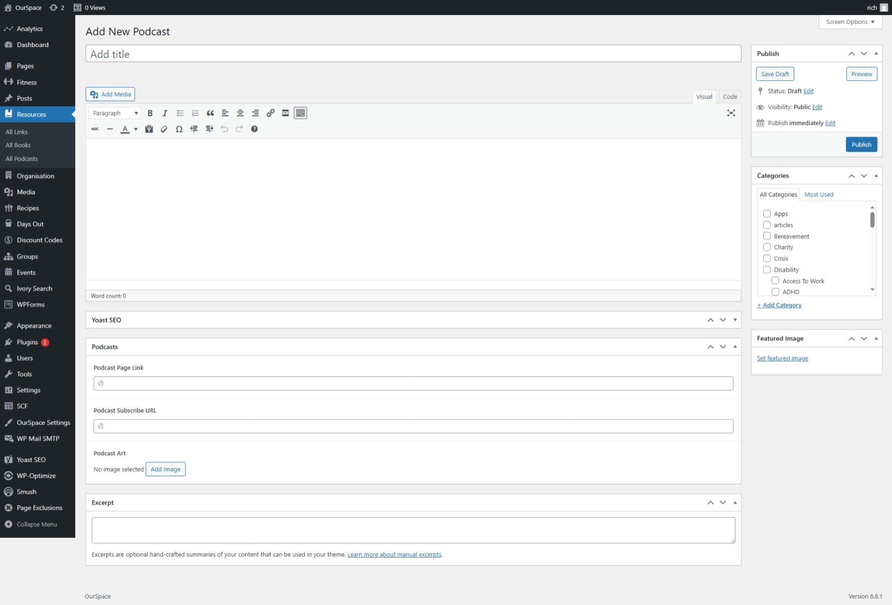

The platform has it's own Podcast directory, this lives under the self-help resources, to add a new entry to the directory follow these steps.

* First navigate to the Admin Dashboard of OurSpace if you are not already there.
* From the navigation menu on the left hand side of the page, hover over resources, from the menu that appears select _Podcasts_
* Click the button _Add new podcast_ a new screen should appear that looks something like the image below

* In the title box at the top of the page, enter the title of the podcast. 
* In the large box below the title, enter a bit about the podcast, usually this can be obtained from the podcast website.

Once you have filled in these two fields, scroll down to the _Podcast Settings_ and complete the fields as required

|Field Name              | Mandatory | Description
|------------------------|---------- |------------------------------ |
| Podcast Page Link      |  No       | The link that will take them to a page about the podcast  |
| Podcast Subscribe URL  |  No       | The link where users can subscribe to the podcast   |
| Podcast Art            |  No       | The artwork of the podcast    |

* On the right side of the page, add a featured image, you can do this by clicking the _Add featured image_ button in the box.

* Once you are happy that all of the information has been completed, scroll back up to the top of the page and click the _Publish_ button which can be found under the _Publish_ section in the right side of the screen.

Your podcast entry should now be visible on the podcasts page.