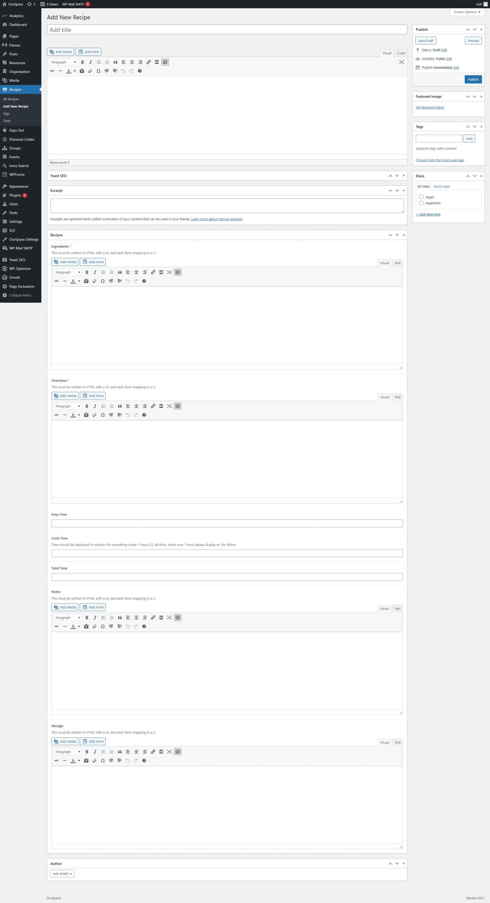

* First navigate to the Admin Dashboard of OurSpace if you are not already there.
* From the navigation menu on the left hand side of the page, select _Recipes_
* Click the button _Add new recipe_ a new screen should appear that looks something like the image below

|Field Name   | Mandatory | Description
|-------------|-----------|----------------------------------------------------------- |
| Ingredients |  Yes      | The ingredients that are required to make the recipe       |
| Directions  |  Yes      | The directions that must be followed to make the recipe    |
| Prep Time   |  No       | The preparation time for the recipe    					   |
| Cook Time   |  No       | The cooking time for the recipe     					   |
| Total Time  |  No       | The total time to make the recipe Prep + Cook = Total      |
| Notes       |  No       | Any notes that are not captured in the above fields        |
| Storage     |  No       | Storage information for the dish after it has been cooked. |

Once you are happy that all of the information has been completed, scroll back up to the top of the page and click the _Publish_ button which can be found under the _Publish_ section in the right side of the screen.

Your recipe should now be visible on the recipes page.