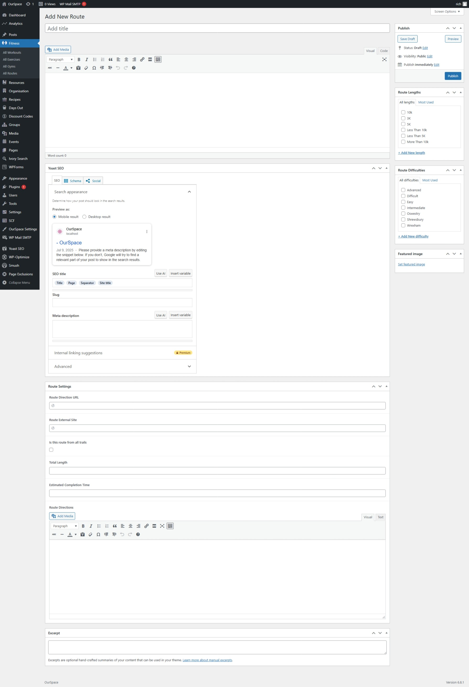
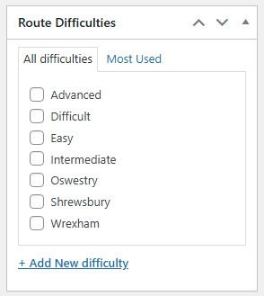
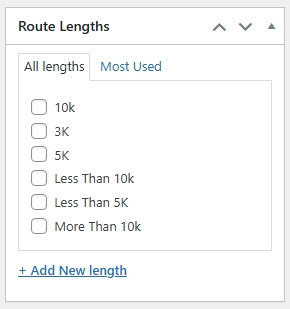

* First navigate to the Admin Dashboard of OurSpace if you are not already there.
* From the navigation menu on the left hand side of the page hover over _Fitness_ and select _All Routes_ from the menu that appears
* Click the button _Add new route_ a new screen should appear that looks something like the image below

|Field Name                      | Mandatory | Description												  | Condition
|--------------------------------|-----------|----------------------------------------------------------- | ------------
| Is this route from all trails  |  No       | Is this route taken from AllTrails                         |
| Route Direction URL            |  No       | The embed link for the route directions                    | Displayed if _Is this route from all trails_ is checked
| Route External Site            |  No       | The link to the route details on AllTrails                 | Displayed if _Is this route from all trails_ is checked
| Total Length                   |  No       | Total length of the route                                  |
| Estimated Completion Time      |  No       | Estimated time to complete the route                       |
| Route Directions               |  No       | Detailed directions of the route                           |

Scroll back to the top of the page and on the right hand side you will see some additional options

Route difficulty, this is how difficult the route is expected to be

The route length, this can be used for running routes, to give runners an idea of how long the route is

Once you are happy that all of the information has been completed, scroll back up to the top of the page and click the _Publish_ button which can be found under the _Publish_ section in the right side of the screen.

Your route should now be visible on the routes page.