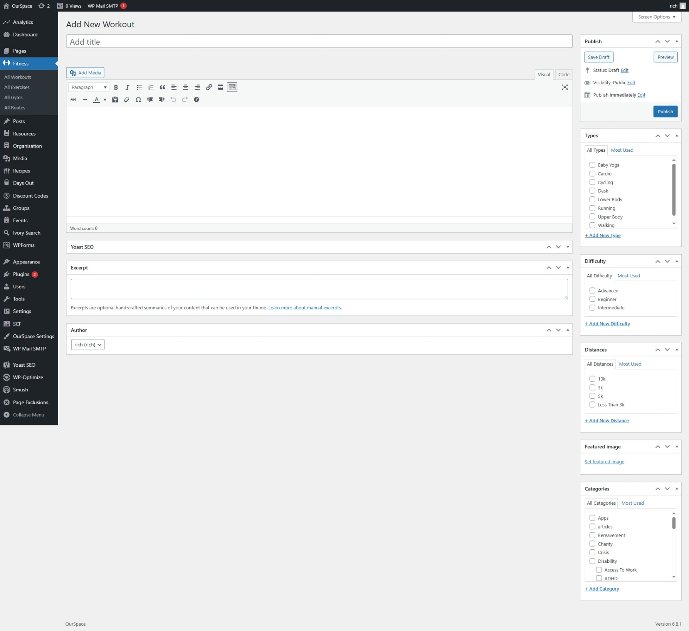

* First navigate to the Admin Dashboard of OurSpace if you are not already there.
* From the navigation menu on the left hand side of the page hover over the _Fitness_ menu and select the _Workouts_ menu from the options that appear. 
* Click the button _Add new workout_ a new screen should appear that looks something like the image below

Once you are happy that all of the information has been completed, scroll back up to the top of the page and click the _Publish_ button which can be found under the _Publish_ section in the right side of the screen.

Your event should now be visible on the events page.