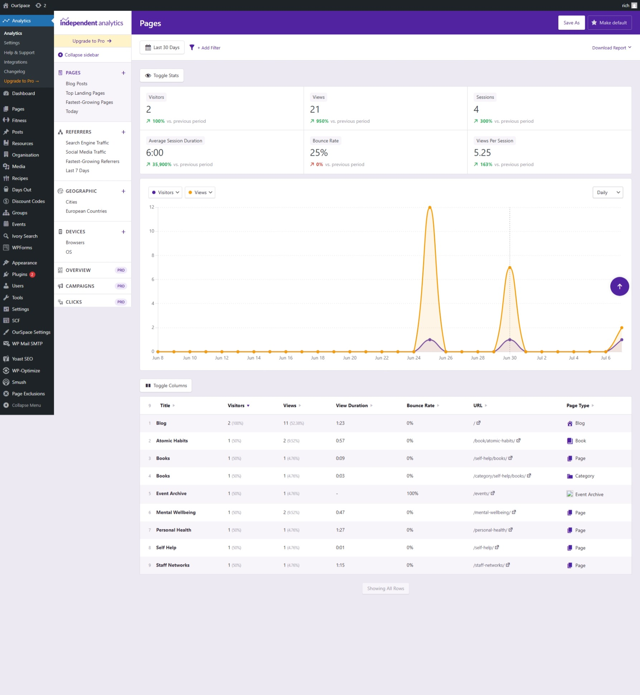

Analytics for the platform are provided by a plugin called Independent Analytics which hosts all the statistics within the platform, this gives wider control over the data collected and doesn't rely on a third party service for data collection.

