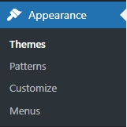
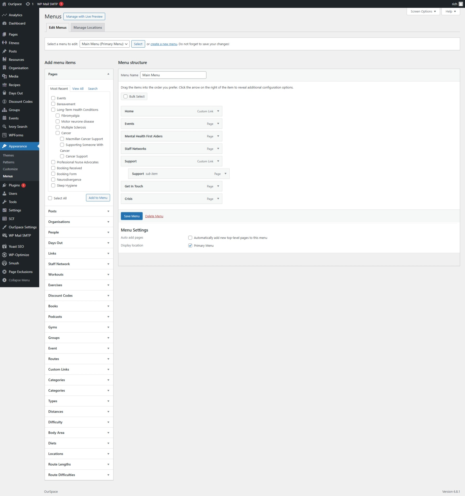

The navigation menus on the platform are defined within the platform backend and controlled through the menu items found in the Appearance section of the backend menu. 

The platform at this time only supports a single navigation, this is the main navigation found at the top of the platform (shown above) the items within this can be controlled from the _menus_ menu within the admin backend. 

From here you should be presented with a page that looks similar to this. 

The drop down at the top shows you which menu you are currently editing.

The Add Menu Items list down the left side of the page has a list of all the items available for addition to the menu that are within the platform listed. 

To add items to the menu, you can simply check the item from the list and press _Add To Menu_ the items will then appear at the bottom of the _Menu Structure_ where you can drag it to your desired location. 

It is possible to nest items within another item to create a drop down menu on the home page, to do this drag the item and drag it slightly to the right of the item you are wanting to nest it in. 

Once you are happy with your changes click _Save Menu_