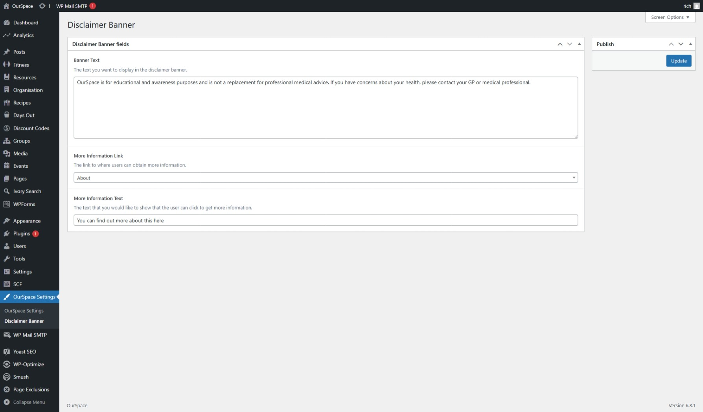
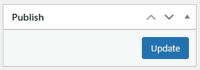

Each page on the platform displays a disclaimer banner unless explicitly excluded users are also able to dismiss the banner which saves a cookie on their machine to hide the banner for `24 hours`

1. Locate the OurSpace settings from the menu on the left side of the screen
2. From the options that appear, click the _Disclaimer Banner_ option, a page like the one below should appear

Fill in the fields as required

|Field Name              | Mandatory | Description
|------------------------|-----------|----------------------------------------------------------------------------------------- |
| Banner Text            |  No       | The text you want to display in the disclaimer banner.    								|
| More Information Link  |  No       | The link to where users can obtain more information.  								    |
| More Information Text  |  No       | The text that you would like to show that the user can click to get more information.    |

Once you are happy with the content, scroll back to the top of the page and find the _Publish_ box on the right side of the screen, from here press _Update_ and your settings will be saved. 

