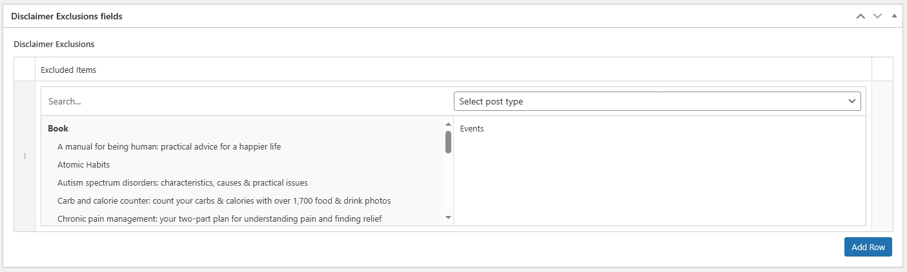

It is possible within the platform to exclude certain pages from displaying some of the core platform content.

To configure the pages you wish to exclude, locate the _OurSpace Settings_ menu from the left menu in the backend and hover over it, multiple options will appear select _Search Exclusions_

From the option that appears, select the item that you wish to add to the exclusions, click on it and it will appear in the right hand section of the Excluded Items

Once you are happy with the content, scroll back to the top of the page and find the _Publish_ box on the right side of the screen, from here press _Update_ and your settings will be saved. 

