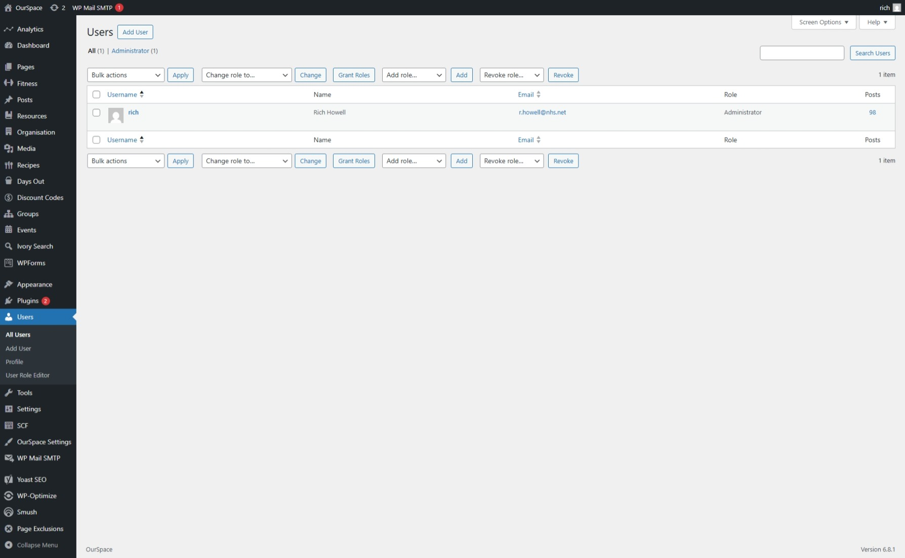
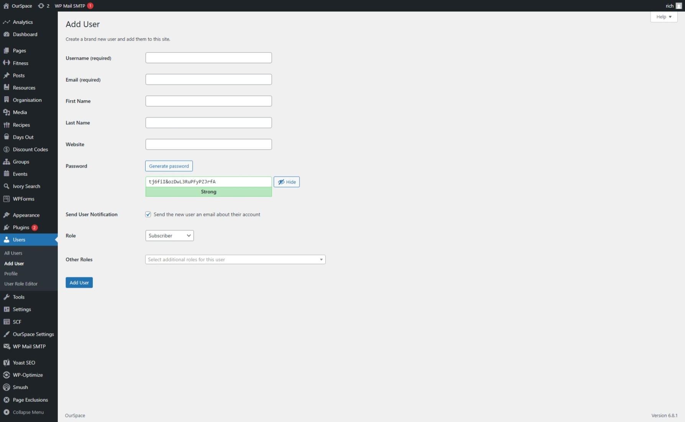

Adding users to the platform can only be actioned by Maintainers & Administrators.

1. Navigate to the Users section of the _The Backend_ from here.

2. From here click _Add New User_ 

Complete all of the fields as required 

Field | Description
|------| ----------
Username (required) | The username that the user will use to login to the platform with.
Email (required) | The users email address, this must be valid to ensure the registration email is sent. 	
First Name	| The First name of the user
Last Name	| The Last name of the user 
Password | Password that will be assigned to the user, this is auto generated. 
Send User Notification	| If you would like to send the user a email confirmation, click this box
Role | The [role](the-backend/user-management/roles.md) that you would like to assign to the user, if you are unsure which role is appropriate please see the [roles](the-backend/user-management/roles.md) guidance. 