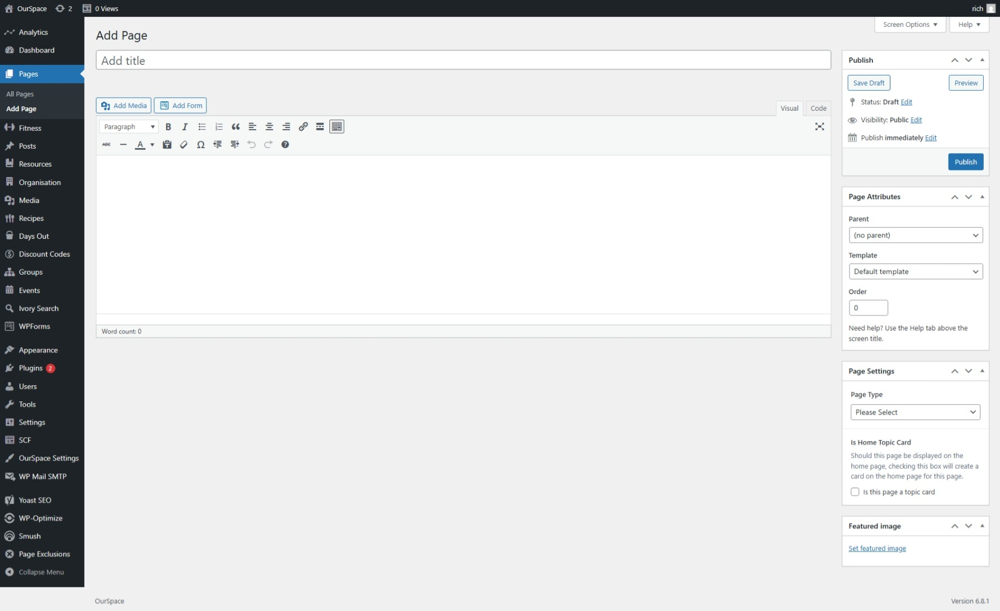
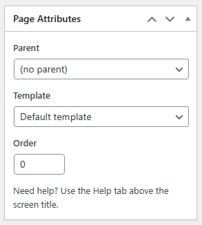
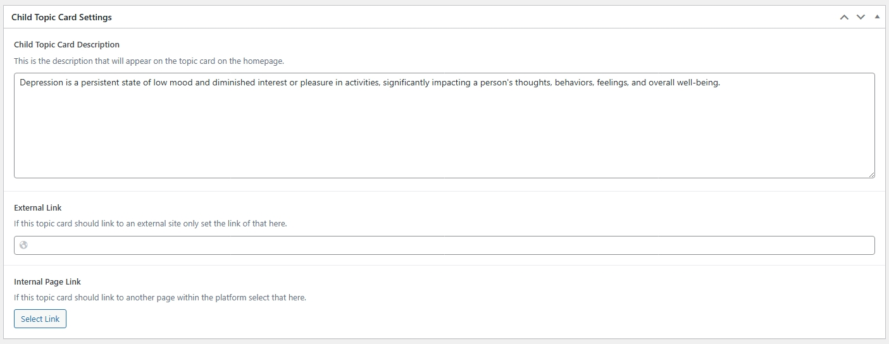
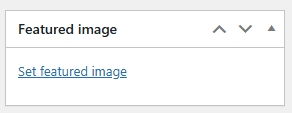

A child topic is a topic that resides within another topic. For example `Anxiety` resides within `Mental Wellbeing` the below instructions show how to create a child topic within the platform.

* First navigate to the Admin Dashboard of OurSpace if you are not already there.
* From the navigation menu on the left hand side of the page, select _Pages_
* Click the button _Add Page_ a new screen should appear that looks something like the image below

* From the right hand side, find the section titled _Page attributes_ and set the _Page Template_ to `Hub Page Template` this should then open up a number of additional options at the bottom of the screen
* In the Parent drop down box, select the topic that you wish for this child topic to appear within.

* First we must give our Topic a title, scroll back to the top of the screen and in the _Add Title_ box give your title a name, this is the name that will appear on the homepage.

* In the large box under the title, you can enter a little bit about this topic, this will appear at the topic of the topic page, if you don't want to provide any information on the topic, leave this blank and simply move onto the next step.

As we are creating a new topic we are only interested in the _Child Topic Card Settings_ go ahead and fill in the boxes for your topic.

- Child Topic Card Description - This is the description of the topic that will appear on the card on the home page.
- External Link - If the topic card is to link to an external resource, the link should be provided here.
- Internal Page Link - If the topic card is to link to another page within the platform you can select that here.

Lastly, the topic needs a cover card, to set this, find the _Featured Image_ section in the right hand side of the screen, click the _Set Featured Image_ link and select your media.

Once you are happy that all of the information has been completed, scroll back up to the top of the page and click the _Publish_ button which can be found under the _Publish_ section in the right side of the screen.

Your child topic should now appear within the parent you selected. 