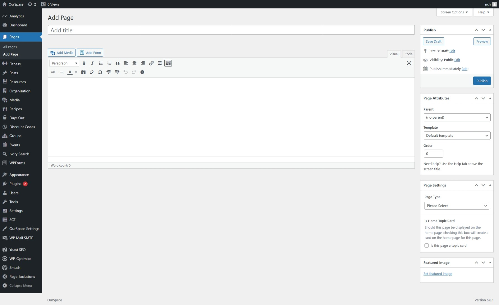
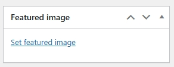

As discussed in the [_what is a topic_](docs/topics/what-is-a-topic.md) section, each topic on OurSpace is a top level category that houses other content, in this section we are going to look at how to add a new topic to OurSpace. 

* First navigate to the Admin Dashboard of OurSpace if you are not already there.
* From the navigation menu on the left hand side of the page, select _Pages_
* Click the button _Add Page_ a new screen should appear that looks something like the image below

From the right hand side, find the section titled _Page attributes_

1. Leave the parent drop down set to _(no parent)_ 
2. Set the _Page Template_ to `Topic Page` this should open up a number of additional options at the bottom of the screen.
3. Set the order value, this determines where on the home page the card will appear.

First we must give our Topic a title, scroll back to the top of the screen and in the _Add Title_ box give your title a name, this is the name that will appear on the homepage.

In the large box under the title, you can enter a little bit about this topic, this will appear at the topic of the topic page, if you don't want to provide any information on the topic, leave this blank and simply move onto the next step.

As we are creating a new topic we are only interested in the _Topic Card Settings_ go ahead and fill in the boxes for your topic.

- Topic Card Description - This is the description of the topic that will appear on the card on the home page.
- External Link - If the topic card is to link to an external resource, the link should be provided here.
- Internal Page Link - If the topic card is to link to another page within the platform you can select that here.

Once all of the boxes have been completed, back on the right side of the screen find _Page Settings_ 

1. Page type can be left alone, this isn't required on this template .
2. Check the box `Is this page a topic card` this will ensure that the topic card is shown on the homepage of the platform. 

Lastly, the topic needs a cover card, to set this, find the _Featured Image_ section in the right hand side of the screen, click the _Set Featured Image_ link and select your media.

Once you are happy that all of the information has been completed, scroll back up to the top of the page and click the _Publish_ button which can be found under the _Publish_ section in the right side of the screen.

Your topic card should now be visible on the home page.